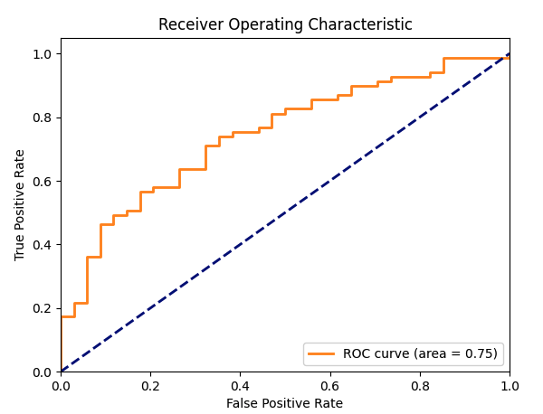
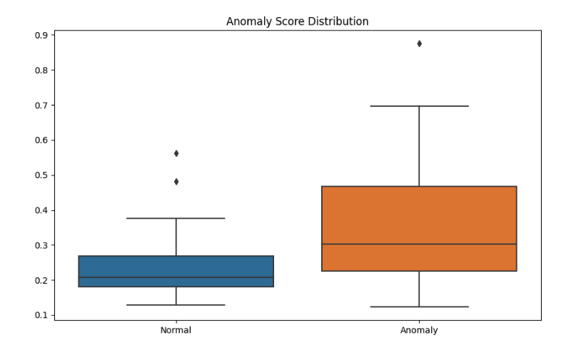

# THOR_DDPM_IDRiD

IDRiD-focused adaptation of THOR_DDPM for retinal anomaly detection with diffusion reconstruction.

Upstream source: https://github.com/ci-ber/THOR_DDPM

## Example Output


## Setup
1. Create environment:
```bash
conda create -n thor python=3.8
conda activate thor
```
2. Install PyTorch for your system (CPU/CUDA).
3. Install dependencies:
```bash
pip install -r pip_requirements.txt
```

Logging is local in this branch (`weights/`, `results/`). `wandb login` is not required.

## Data Preparation
Use `projects/thor/configs/IDRiD/thor.yaml` and prepare these CSV splits:
- `data/IDRiD_normalize/splits/train_normal.csv`
- `data/IDRiD_normalize/splits/train_idrid_only.csv`
- `data/IDRiD_normalize/splits/val_normal.csv`
- `data/IDRiD_normalize/splits/test_normal.csv`
- `data/IDRiD_normalize/splits/test_DR.csv`

CSV format:
```csv
filename
/path/to/image_001.png
/path/to/image_002.png
```

Label rule in evaluator:
- path containing `/normal/` or `/good/` -> `label=0`
- otherwise -> `label=1`

## Run
```bash
python core/Main.py --config_path projects/thor/configs/IDRiD/thor.yaml
```

For training:
- set `experiment.task: train`
- set `experiment.weights: null`

For evaluation:
- set `experiment.task: test`
- set `experiment.weights: <path_to_best_model.pt>`

## Outputs
Checkpoint folder:
- `weights/thor/idrid/<timestamp>/`
- includes `latest_model.pt`, `best_model.pt`, `Val_epoch_*.png`

Evaluation folder:
- `results/<timestamp>/`
- `per_image_scores.csv` (always saved; `Pred_Label` and `Correct` appear only when threshold is available)
- `global_metrics.txt` (always saved; AUROC/AUPRC only when both classes exist)
- `roc_curve.png` (only when both classes exist)
- `score_overlap.png` (only when overlap is computable)
- `visualizations/*.png`

## Metric Examples
ROC curve example:



Anomaly score distribution (custom analysis example):



## Notes
- Data, checkpoints, and results are git-ignored.
