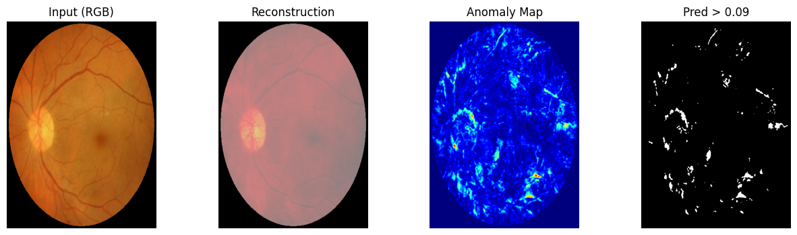

# THOR_DDPM_IDRiD

IDRiD-focused adaptation of THOR_DDPM for diffusion-based retinal anomaly detection.

The project trains a DDPM model for reconstruction, then uses reconstruction error and THOR-style harmonized diffusion inference to produce anomaly maps and image-level anomaly scores for diabetic retinopathy screening.

## Upstream Credit
This project is adapted from the original **THOR_DDPM** repository by **Cosmin I. Bercea, Benedikt Wiestler, Daniel Rueckert, and Julia Schnabel**.

Original source: https://github.com/ci-ber/THOR_DDPM

The core method and original implementation are from the upstream authors; this repository focuses on an IDRiD-oriented configuration and evaluation workflow.

## Example Output


## What This Repository Contains
- IDRiD-specific config: `projects/thor/configs/IDRiD/thor.yaml`
- IDRiD RGB loader with train/test transforms: `data/loaders/IDRiD_loader.py`
- THOR-style DDPM training: `projects/thor/DDPMTrainer.py`
- IDRiD downstream evaluator with local saving of metrics/plots/visualizations: `projects/thor/DownstreamEvaluatorIDRiD.py`

## Pipeline Overview
1. Train DDPM reconstruction model on the configured IDRiD training splits.
2. Reconstruct input images through diffusion reverse process.
3. Build anomaly map from reconstruction residuals (THOR inference path).
4. Apply FOV-aware masking to focus scoring inside retina region.
5. Compute image-level anomaly score (masked L2), AUROC/AUPRC, and thresholded predictions.
6. Save per-image CSV + plots + side-by-side visualizations.

## Project Structure
```text
THOR_DDPM_IDRiD/
  core/                         # framework entrypoints (Main, Configurator, DataLoader)
  projects/thor/
    configs/IDRiD/thor.yaml     # main experiment config
    DDPMTrainer.py              # training routine
    DownstreamEvaluatorIDRiD.py # IDRiD evaluation logic
  data/loaders/                 # dataset loaders (IDRiD, xray, brain)
  model_zoo/                    # DDPM model definition
  net_utils/                    # schedulers, UNet blocks, inferers
  optim/                        # losses and metrics
  assets/Thor_IDRID.png         # README sample figure
```

## Environment Setup
1. Create environment:
```bash
conda create -n thor python=3.8
conda activate thor
```

2. Install PyTorch (CUDA or CPU build matching your machine).

3. Install project dependencies:
```bash
pip install -r pip_requirements.txt
```

4. Optional logging setup:
```bash
wandb login
```

## Data Preparation (IDRiD)
This repository does not include IDRiD images or split files. You need to create them locally.

Expected in config (`thor.yaml`):
- Train CSVs:
  - `data/IDRiD_normalize/splits/train_normal.csv`
  - `data/IDRiD_normalize/splits/train_idrid_only.csv`
- Val CSV:
  - `data/IDRiD_normalize/splits/val_normal.csv`
- Test CSVs:
  - `data/IDRiD_normalize/splits/test_normal.csv`
  - `data/IDRiD_normalize/splits/test_DR.csv`

CSV format:
- Header must be `filename`
- Each next row is one image path (absolute or relative)

Example:
```csv
filename
/path/to/IDRiD_normalize/normal/img_001.png
/path/to/IDRiD_normalize/DR/img_245.png
```

Label behavior in evaluator:
- File path containing `/normal/` or `/good/` is treated as normal (`label=0`)
- Other paths are treated as anomaly (`label=1`)

## Configuration Guide
Main config file: `projects/thor/configs/IDRiD/thor.yaml`

Important fields:
- `experiment.task`: set `train` for training or `test` for evaluation-only
- `experiment.weights`: checkpoint to load (`best_model.pt`) for evaluation
- `trainer.params.checkpoint_path`: base output path for run checkpoints
- `model.params.inference_type`: should be `thor` for THOR-style anomaly inference
- `model.params.noise_level_recon`: reconstruction noise level
- `model.params.t_harmonization`: diffusion timesteps used in harmonization

## Run
Default command:
```bash
python core/Main.py --config_path projects/thor/configs/IDRiD/thor.yaml
```

For training:
- In `thor.yaml`, set `experiment.task: train`
- Set `experiment.weights: null` (or remove it) to start from scratch

For evaluation-only:
- In `thor.yaml`, set `experiment.task: test`
- Set `experiment.weights` to a trained checkpoint path

## Outputs
Training/evaluation checkpoints are saved to:
- `weights/thor/idrid/<timestamp>/`

Typical checkpoint files:
- `latest_model.pt`
- `best_model.pt`
- `Val_epoch_*.png` (validation sample visualization)

Downstream IDRiD evaluation artifacts are saved to:
- `results/<timestamp>/`

Typical result files:
- `per_image_scores.csv` (score + label + prediction per image)
- `global_metrics.txt` (AUROC, AUPRC, threshold, overlap)
- `roc_curve.png`
- `score_overlap.png`
- `visualizations/*.png` (Input / Reconstruction / Anomaly Map / Thresholded mask)

## Common Issues
- `FileNotFoundError` for CSV paths: verify split paths in `thor.yaml`.
- Empty or incorrect labels: ensure normal files include `/normal/` or `/good/` in their paths.
- CUDA issues: install a PyTorch version compatible with your local CUDA runtime.

## Attribution
This work is based on the original THOR_DDPM repository by Cosmin I. Bercea, Benedikt Wiestler, Daniel Rueckert, and Julia Schnabel:
https://github.com/ci-ber/THOR_DDPM

## Citation
If you use this work, please cite the original paper:

```bibtex
@misc{Bercea2024diffusion,
    title={Diffusion Models with Implicit Guidance for Medical Anomaly Detection},
    author={Cosmin I. Bercea and Benedikt Wiestler and Daniel Rueckert and Julia Schnabel},
    year={2024},
    month={3},
    eprint={2403.08464},
    archivePrefix={arXiv},
    primaryClass={cs.CV}
}
```

## Notes
- Data, checkpoints, and results are intentionally git-ignored.
- Upstream repository does not provide a top-level license in this copy; use accordingly.
